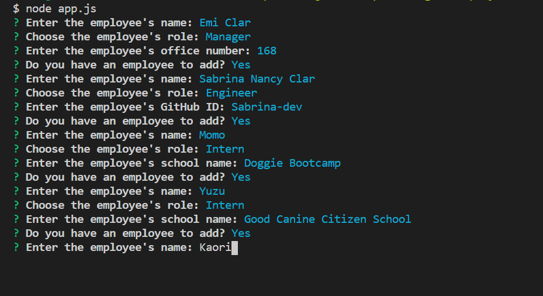

# Template-Engine-Employee-Summary
A software engineering team generator command line application.

### Table of Contents
* General Info
* Files
* Technologies

### General Info
This application will prompt the user for information about the team manager and then information about the team members. The user can input any number of team members, and they may be a mix of engineers and interns. This assignment must also pass all unit tests. When the user has completed building the team, the application will create an HTML file that displays a nicely formatted team roster based on the information provided by the user.

### Link
[Click here to see the Employee Summary](https://emi-dev.github.io/Template-Engine-Employee-Summary/output/team.html)

### Files
* app.js
* Employee.js (under "lib")
* Manager.js (under "lib")
* Engineer.js (under "lib")
* Intern.js (under "lib")
* generateHTML.js (under "templates")
* generateManagerCard.js (under "templates")
* generateEngineerCard.js (under "templates")
* generateIntern.js (under "templates")
* package.json
* package-lock.json
* README.md

### Technologies
Project is created with:
* JavaScript
* Node
* HTML
* Bootstrap 4